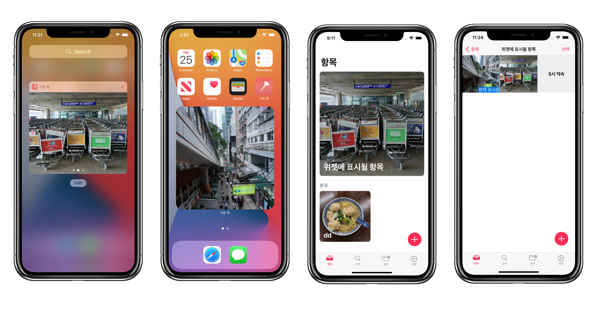
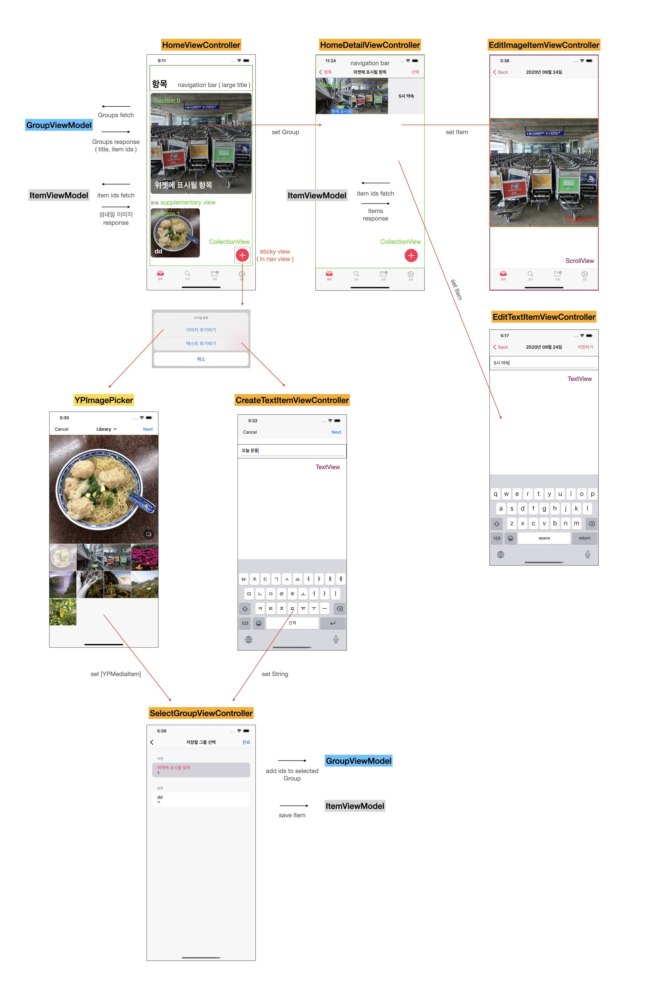

#  사진 콕




> 위젯에서 사진, 메모를 쉽게 확인

[](https://apps.apple.com/kr/app/%EC%82%AC%EC%A7%84-%EC%BD%95/id1526039511)

## 사용 프레임워크
- UIKit
- SwiftUI
- WidgetKit
- StoreKit

## 아키텍처 
- MVVM 패턴을 최대한 반영하고자 했습니다.

<br>

# 목차
- [기능](#feature)
- [설계](#structure)
- [문제 해결](#troubleshooting)

<br> 

# 기능 <a id="feature"></a>

## Today Extension
  
  
## Widget ( iOS 14 )
  
  
## Group & Search
  

## Setting
  
<br>

# 설계 <a id="structure"></a>

## Model & ViewModel


## Controller & View


# 문제 해결 <a id="troubleshooting"></a>

## Today Extension Memory Issue
  
- 문제점
    - "Enable to Load" 라는 알림이 남고 위젯이 로드되지 않는 현상
    - Today Extension 의 경우 시스템에서 16MB 로 제한됨
    - https://reactnative.dev/docs/app-extensions
- 해결
    - 사용자가 위젯에 추가할 수 있는 사진 개수를 제한하였음 (20개)
    - 또한 NSpredicate 를 통해 필요한 사진만 CoreData 에서 Fetch 하도록 구성
    ```swift
        fetchRequest.sortDescriptors = [idSort]
        fetchRequest.predicate = NSPredicate(format: "id IN %@", newIds)
    ```
<br>

## Today Extension Collection View Scroll Issue

- 문제점
    - iOS 13 -> 14 로 업데이트 후 위젯 콜렉션 뷰가 스크롤 되지 않는 문제
    - 기존 방식은 scrollToItem IndexPath 를 넘겨서 버튼으로 스크롤 하였음

- 해결
    - 직접 scrollView 에 bounds origin 을 변경하였더니 스크롤이 됨
    - 따라서 SetContentOffSet 통해 스크롤하는 메소드 설계

    ```swift
    func scrollItemCollectionView(to index: Int, animated: Bool) {
        let spacing: CGFloat = itemCollectionView.bounds.width
        
        itemCollectionView.setContentOffset(CGPoint(x: spacing * CGFloat(index), y: 0), animated: animated)
    }
    ```
<br>

## Strong Retain Cycle
- 문제점
    - HomeDetailViewController 가 deinit 되지 않는 문제
    - Observer 를 등록하고 제거하지 않았고 Model 에서 계속 VC 를 참조하여 발생
- 해결
    - 등록한 Observer 을 삭제하기 위해 Protocol 에 구분자를 추가하였음
    - VC 가 사라질 때 등록한 Obserber 제거 하도록 구성
    ```swift
    // HomeDetailViewController.swift

    class HomeDetailViewController: UIViewController {
        override func viewDidDisappear(_ animated: Bool) {
            if isMovingFromParent {  // Parent VC 로 이동할 때 제거
                groupViewModel.removeOberserver(self)
            }
        }
        ...
    }

    extension HomeDetailViewController: GroupObserver {
        var groupIdentifier: String {
            return HomeDetailViewController.observerName()
        }
        
        func updateGroup() {
            guard let group = group, let newGroup = groupViewModel.group(by: group.name) else { return }
            
            itemViewModel.loadFromIds(ids: newGroup.ids)
            itemCollectionView.reloadData()
        }
    }
    ```
